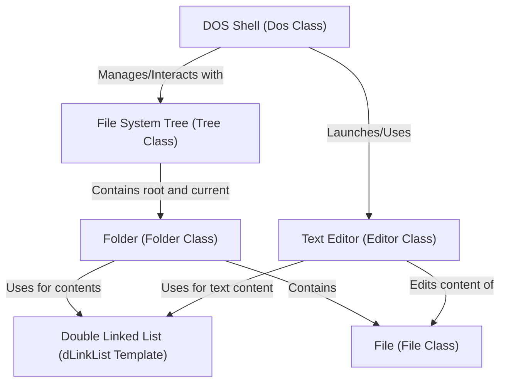
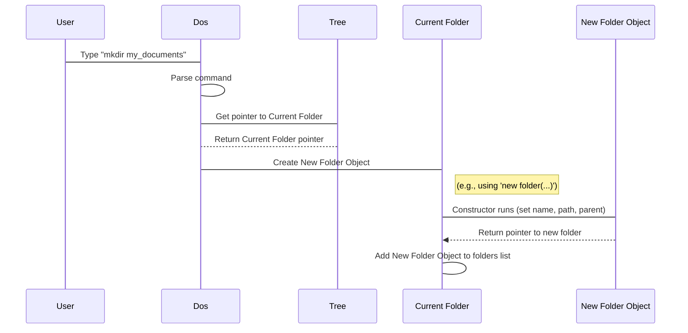
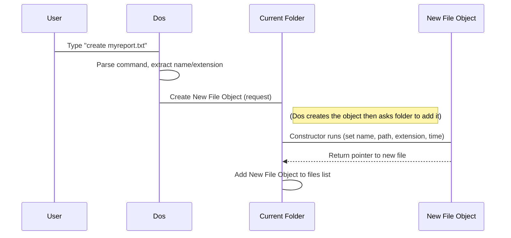
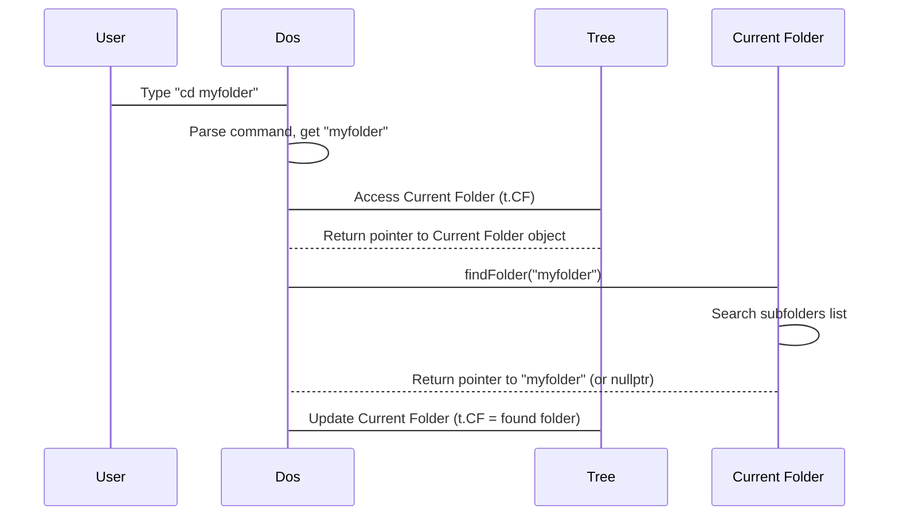
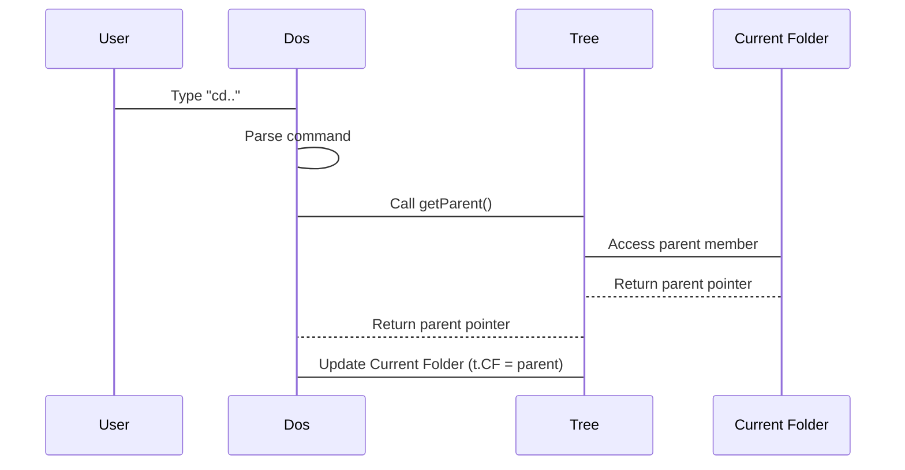
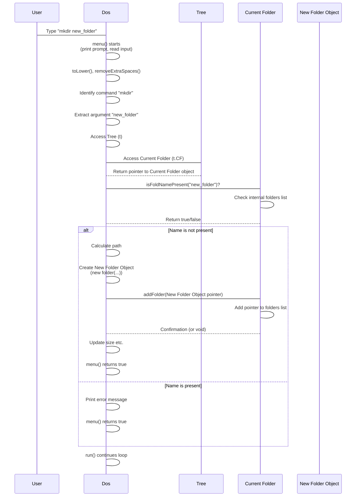
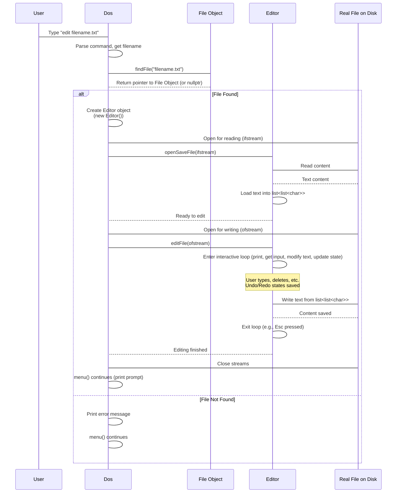

# Tutorial: Dos_Shell_With_NotePade_In_Cpp

This project creates a **virtual DOS-like shell** where users can navigate and manage a simulated **file system**.
It allows commands like `mkdir` (create *folders*), `create` (create *files*), `cd` (change *directories*), and includes a simple **text editor** to *view and modify* the content of *files*.


## Visual Overview



## Chapters

1. [Folder (Folder Class)
](01_folder__folder_class__.md)
2. [File (File Class)
](02_file__file_class__.md)
3. [File System Tree (Tree Class)
](03_file_system_tree__tree_class__.md)
4. [DOS Shell (Dos Class)
](04_dos_shell__dos_class__.md)
5. [Text Editor (Editor Class)
](05_text_editor__editor_class__.md)
6. [Double Linked List (dLinkList Template)
](06_double_linked_list__dlinklist_template__.md)

---
# Chapter 1: Folder (Folder Class)

Welcome to the first chapter of our tutorial on building a simple DOS-like shell in C++! We're starting at the very foundation of our project: the concept of a "Folder".

Imagine how you organize things in the real world. You might use physical folders to keep papers together, or drawers, or boxes. On your computer, we do something similar using directories, often called "folders". They are containers that help us store and organize our files and other folders.

In our C++ project, we need a way to represent these containers. That's where the `Folder` class comes in. A `Folder` object in our program will be like a digital container, holding information about itself and what's inside it.

### What is a Folder in our Project?

Think of a `Folder` object as a digital representation of a directory on your computer. It serves as a building block for creating a hierarchical file system structure, just like the C: drive, Program Files folder, or your Documents folder you see on your own computer.

Each `Folder` object needs to know:

*   **Its Name:** What it's called (e.g., "Documents", "Pictures", "MyProject").
*   **Its Path:** Where it is located within the overall structure (e.g., "v:\Users\MyProject").
*   **What it Contains:** A list of other `Folder` objects (subfolders) and a list of [File objects](02_file__file_class__.md) it holds.
*   **Basic Information:** Like its size or when it was created.

The `Folder` class will also have actions (methods) that allow us to manage its contents, such as adding a new folder or file, finding an item by its name, or removing something.

### Use Case: Creating a New Folder

Let's look at a common task in any file system: creating a new folder. In a real DOS shell, you'd use the `mkdir` command. In our project, the `Dos` class handles user commands, and when it sees `mkdir`, it needs to interact with the file system structure to make a new folder object and place it inside the *current* folder the user is in.

The `Folder` class needs to provide the capability to add a new folder to its list of contents.

### How the `Folder` Class Helps

The `Folder` class provides the structure and methods to perform operations like adding a new subfolder.

Looking at the `Folder.h` code provided:

```c++
class folder
{
public:
    int fsize;
    string name;
    dLinkList<folder*> folders; // List of subfolders
    dLinkList<file*> files;   // List of files
    folder* parent;         // Pointer to the folder containing this one
    string owner;
    string path;
    string timeCreated;
    bool isHidden;
    bool isReadOnly;
    // ... constructors ...
    void addFolder(folder* f); // Method to add a subfolder
    // ... other methods ...
};
```

This snippet shows some key parts:
*   `name` and `path` store the folder's name and location.
*   `folders` and `files` are special lists (using a [Double Linked List](06_double_linked_list__dlinklist_template__.md) structure, which we'll cover later) that hold pointers to the sub-folders and files inside *this* folder.
*   `parent` points to the folder that contains this one, helping us navigate up the structure.
*   `addFolder(folder* f)` is a method that allows us to add a new sub-folder (`f`) into the `folders` list of *this* folder object.

### Creating a Folder - Step-by-Step

When you type something like `mkdir my_documents` in our shell, here's a simplified look at what happens involving the `Folder` class:

1.  **User Input:** You type `mkdir my_documents` and press Enter.
2.  **Dos Parses:** The `Dos` class reads your command and figures out you want to `mkdir` (make directory) with the name `my_documents`.
3.  **Locate Parent:** The `Dos` class needs to know *where* to create this new folder. It gets the current folder you are in from the [File System Tree](03_file_system_tree__tree_class__.md) structure. Let's call this `Current Folder`.
4.  **Create New Folder Object:** A brand new `folder` object is created in memory with the name "my\_documents", its path (based on the Current Folder's path), and a pointer back to the Current Folder as its parent. Its internal lists for subfolders and files are initially empty.
5.  **Add to Parent:** The `Current Folder` object uses its `addFolder()` method to add the newly created "my\_documents" folder object to its internal list of `folders`.

Here's a simplified sequence diagram showing this process:



### Inside the Code: Adding a Folder

The `Dos` class has a part that handles the `mkdir` command. Let's look at a simplified version of that section from `Dos.h`:

```c++
// Inside Dos::menu()
else if (op == "mkdir")
{
    // ... (code to get folder name and check if it's valid) ...

    // Get the name the user provided
    string fName = input.substr(op.length() + 1);

    // Check if a folder with this name already exists in the current folder
    if (t.CF->isFoldNamePresent(fName))
    {
        // ... handle overwrite prompt ...
    }
    else
    {
        // Create the full path for the new folder
        string path = t.CF->path + "\\" + fName;
        // Create a new folder object in memory
        folder* nfolder = new folder(fName, path, t.CF);
        // Add the new folder object to the current folder's list of folders
        t.CF->addFolder(nfolder);
        // Update the current folder's size (size() is simplified for now)
        t.CF->fsize += nfolder->size(); // Corrected size calculation conceptual
    }
}
```

This code snippet shows how the `Dos` class:
1.  Extracts the desired folder name (`fName`).
2.  Calls `t.CF->isFoldNamePresent(fName)` on the *current folder object* (`t.CF`, which is a `folder*`) to see if the name is already used.
3.  If the name is available, it calculates the full `path`.
4.  It creates a new `folder` object using `new folder(fName, path, t.CF)`. This calls a constructor of the `Folder` class.
5.  It then calls the `addFolder` method on the *current folder object* (`t.CF->addFolder(nfolder)`) to add the new folder to its contents.

Let's look at the simple `addFolder` method inside `Folder.h`:

```c++
// Inside folder class
void addFolder(folder* f)
{
    folders.insertAtTail(f); // Add the folder pointer to the list
}
```

This method is quite simple! It just takes the pointer to the newly created `folder` object (`f`) and uses the `insertAtTail` method of the `dLinkList` (the `folders` list) to add it to the end of the list of subfolders.

### Other Folder Capabilities

Besides adding folders, the `Folder` class code in `Folder.h` also includes methods for other important actions:

*   `findFolder(string& Name)`: Searches through the `folders` list to find a subfolder by its name.
*   `findFile(string& Name)`: Searches through the `files` list to find a file by its name.
*   `addFile(file* f)`: Adds a [File object](02_file__file_class__.md) to the folder's `files` list.
*   `printFolder()`: Displays information about this specific folder (like its name, path, and creation time).
*   `size()`: Calculates the size of the folder (though the implementation is simplified to just the object's memory size in the provided code).
*   `setTime()`: Records the creation time for the folder.

These methods collectively give the `Folder` object the ability to manage its contents and properties, acting as a true container within our file system simulation.

### Conclusion

In this chapter, we introduced the `Folder` class, which is the fundamental building block representing directories in our virtual DOS shell. We learned that a `Folder` object keeps track of its name, path, parent, and lists of contained folders and files. We walked through a simple use case: creating a new folder using the `mkdir` command, seeing how the `Dos` class interacts with a `Folder` object (specifically, the current folder) to create and add a new sub-folder using the `addFolder` method. This basic container concept is essential for building a file system.

Now that we understand how folders act as containers, the next logical step is to look at the items they contain: files.

[Next Chapter: File (File Class)](02_file__file_class__.md)

---

<sub><sup>Generated by [AI Codebase Knowledge Builder](https://github.com/The-Pocket/Tutorial-Codebase-Knowledge).</sup></sub> <sub><sup>**References**: [[1]](https://github.com/ABDULQAYYUMRAJPOOT208/Dos_Shell_With_NotePade_In_Cpp/blob/25d358006267d2026d16683cda6bcc710979b4da/Dos.h), [[2]](https://github.com/ABDULQAYYUMRAJPOOT208/Dos_Shell_With_NotePade_In_Cpp/blob/25d358006267d2026d16683cda6bcc710979b4da/Folder.h), [[3]](https://github.com/ABDULQAYYUMRAJPOOT208/Dos_Shell_With_NotePade_In_Cpp/blob/25d358006267d2026d16683cda6bcc710979b4da/Tree.h)</sup></sub>


# Chapter 2: File (File Class)

Welcome back! In [Chapter 1: Folder (Folder Class)](01_folder__folder_class__.md), we learned about the `Folder` class, which acts like a digital container, holding other folders and files. We saw how these `Folder` objects help organize our virtual file system.

Now, let's look at the things that go *inside* those folders: the **files**!

### What is a File in our Project?

Think about the icons you click on your computer desktop or inside a folder: a document, a picture, a program, a spreadsheet. These are all files.

In our C++ project, a `File` object is our way of representing one of these digital items. It's not the actual *content* of a document byte-for-byte (like the text inside a `.txt` file), but rather a label or entry for it. It holds important information *about* the file.

A `File` object acts as the **handle** that the Text Editor (which we'll cover later) will use when you want to read or write content to that file.

### Use Case: Creating a New File

Just like creating a new folder, a fundamental task in any shell is creating a new file. In our DOS-like shell, we'll use a command like `create`.

If you type `create mydocument.txt` in our shell, what needs to happen?

1.  The shell needs to understand you want to make a new file.
2.  It needs to know the name (`mydocument`) and the type or extension (`.txt`).
3.  It needs to create a digital representation of this file in our system.
4.  This new file needs to be placed inside the **current folder** you are working in.

This process requires a way to represent the file itself (the `File` class) and a way for the current folder to accept this new file object.

### How the `File` Class Helps

The `File` class defines what a "file" is within our project's file system structure. It gives us a standard way to keep track of the properties of each file.

Looking at the `File.h` code provided:

```c++
class file
{
public:
    int fsize;        // Size of the file (simplified)
    string name;      // Name of the file (e.g., "mydocument")
    string extension; // Extension (e.g., ".txt", ".cpp")
    bool isHidden;    // Is the file hidden?
    string creationTime; // When it was created
    string data;      // Conceptual place for content (string for simplicity)
    string path;      // Full path to the file

    // Constructor to create a new file object
    file(string nm, string pth, string ex);

    int size(); // Method to get size
    void showFileAtrrib(); // Method to display properties
    void setTime(); // Method to set creation time
    // ... other methods ...
};
```

This snippet shows the core pieces of information a `File` object stores:
*   `name`: The main part of the filename.
*   `extension`: The part after the dot (`.txt`, `.cpp`, etc.). This helps identify the file type.
*   `path`: The location where the file resides (`v:\...\mydocument.txt`).
*   `creationTime`: When the file was created.
*   `fsize`: Its size (in this project, this is a simplified representation, often just the size of the `file` object itself, not the content size).
*   `data`: This is where the actual file content *would* be stored if this were a full file system. In our simple text editor later, we'll use this string member to hold the text content when a file is opened.
*   `isHidden`: A property that can be set (though not fully implemented for complex behavior).

The methods (`size()`, `showFileAtrrib()`, `setTime()`) provide actions related to the file's properties.

### Creating a File - Step-by-Step

Let's trace what happens when you type `create myreport.txt` in our shell:

1.  **User Input:** You type `create myreport.txt` and press Enter.
2.  **Dos Parses:** The `Dos` class (our command handler) reads the input, identifies the command `create`, and extracts the desired filename `myreport.txt`.
3.  **Separate Name and Extension:** The `Dos` class or a helper function figures out the name is "myreport" and the extension is ".txt".
4.  **Locate Parent:** The `Dos` class gets the pointer to the `Current Folder` object you are currently inside (from the [File System Tree](03_file_system_tree__tree_class__.md)).
5.  **Create New File Object:** A brand new `file` object is created in memory using the `new file(...)` constructor call. It's given the name "myreport", the extension ".txt", and calculates its full path based on the Current Folder's path. It also records the current time as its creation time.
6.  **Add to Parent Folder:** The `Current Folder` object uses its `addFile()` method to add the pointer to this newly created "myreport.txt" file object into its internal list of `files`.

Here's a simplified sequence diagram:



### Inside the Code: Creating and Adding a File

Let's look at the relevant parts from the code. First, the `Dos` class section that handles the `create` command (from `Dos.h`):

```c++
// Inside Dos::menu()
else if (op == "create")
{
    if (input.length() >= op.length() + 1)
    {
        string fullFileName = input.substr(op.length() + 1, input.length());
        // ... (validation code skipped for simplicity) ...

        // Separate name and extension
        string fName = sepName(fullFileName); // Extracts "myreport"
        string extension = fullFileName.substr(fullFileName.find('.')); // Extracts ".txt"

        // Create the full path
        string path = "\\" + t.CF->path + "\\" + fullFileName;

        // Create a new file object in memory
        file* nfile = new file(fName, path, extension);

        // Add the new file object to the current folder's list of files
        t.CF->addFile(nfile);

        // Update the current folder's size (conceptual)
        t.CF->fsize += nfile->fsize; // Added file size to folder size
    }
    // ... (handle missing filename) ...
}
```
This snippet shows how `Dos`:
1. Gets the full filename from the input.
2. Uses helper functions (`sepName`, `substr`) to split it into the base name and extension.
3. Constructs the full `path`.
4. Creates the `file` object using `new file(...)`.
5. Calls the `addFile` method on the `Current Folder` (`t.CF->addFile(nfile)`).

Now, let's look at the `addFile` method inside `Folder.h`:

```c++
// Inside folder class
void addFile(file* f)
{
    files.insertAtTail(f); // Add the file pointer to the list
}
```
Very simple! It just takes the pointer to the new `file` object (`f`) and adds it to the end of the `files` list using the `dLinkList`'s `insertAtTail` method.

Finally, let's peek at the `File` class constructor and a few methods in `File.h`:

```c++
// Inside file class
file::file(string nm, string pth, string ex)
    : name(nm), isHidden(false), extension(ex)
{
    // name = nm; // Already done by initializer list above
    // extension = ex; // Already done by initializer list above
    path = pth;
    setTime();    // Call method to set creation time
    fsize = size(); // Calculate initial size
}

int file::size()
{
    return sizeof(*this); // Returns the memory size of the file object itself
}

void file::setTime()
{
    // Code to get current system time and format it into a string
    // ... (details skipped) ...
    creationTime = dt; // Stores the formatted time string
}

void file::showFileAtrrib()
{
    // Prints file properties like size, time, path, name, extension
    cout << " A\t\t" << creationTime << "\t\t" << size() << " bytes"
         << "\t\t< " << extension << " >\t\t" << this->path << "\t\t< " << name << " >" << endl;
}
```

This shows:
*   The `file` constructor takes the name, path, and extension. It initializes the object's members, calls `setTime()` to record when it was created, and calculates its initial `fsize`.
*   The `size()` method provides a simple way to get the object's size.
*   `setTime()` uses system functions to get the current time and format it nicely.
*   `showFileAtrrib()` formats and prints the file's properties, similar to a `dir` command output.

Notice how the `File` object doesn't store the content (`data`) right away when created. That happens later when the Text Editor interacts with the file. The `File` object exists *first* as an entry in a folder's list, holding just the metadata about the file.

### Other File Capabilities

Besides being created and holding basic properties, the `File` class in `File.h` might also include methods for:

*   Reading content (potentially interacting with the `data` member or a real file on disk).
*   Writing content (updating the `data` member or a real file).
*   Getting or setting attributes like `isHidden`.
*   Comparing files (for sorting or finding).

These methods would allow other parts of the program (like the Text Editor or `find` command) to interact with the `File` object.

### Conclusion

In this chapter, we explored the `File` class, the core representation of a file entry in our virtual file system. We learned that a `File` object primarily stores metadata like name, extension, path, size, and creation time, and serves as the handle for interacting with file content later. We walked through the process of creating a new file using the `create` command, seeing how the `Dos` class creates a `File` object and asks the `Current Folder` to add it using the `addFile` method.

Understanding `Folder` as a container and `File` as the item inside the container is crucial for building our file system structure. But how do we connect all these folders and files together into a single, navigable tree? That's what we'll cover next.

[Next Chapter: File System Tree (Tree Class)](03_file_system_tree__tree_class__.md)

---

<sub><sup>Generated by [AI Codebase Knowledge Builder](https://github.com/The-Pocket/Tutorial-Codebase-Knowledge).</sup></sub> <sub><sup>**References**: [[1]](https://github.com/ABDULQAYYUMRAJPOOT208/Dos_Shell_With_NotePade_In_Cpp/blob/25d358006267d2026d16683cda6bcc710979b4da/Dos.h), [[2]](https://github.com/ABDULQAYYUMRAJPOOT208/Dos_Shell_With_NotePade_In_Cpp/blob/25d358006267d2026d16683cda6bcc710979b4da/File.h), [[3]](https://github.com/ABDULQAYYUMRAJPOOT208/Dos_Shell_With_NotePade_In_Cpp/blob/25d358006267d2026d16683cda6bcc710979b4da/Folder.h), [[4]](https://github.com/ABDULQAYYUMRAJPOOT208/Dos_Shell_With_NotePade_In_Cpp/blob/25d358006267d2026d16683cda6bcc710979b4da/Tree.h)</sup></sub>


# Chapter 3: File System Tree (Tree Class)

Welcome back! In [Chapter 1: Folder (Folder Class)](01_folder__folder_class__.md), we learned how a `Folder` object acts as a container for other folders and files. In [Chapter 2: File (File Class)](02_file__file_class__.md), we explored the `File` object as the item stored within those containers.

But how do all these individual folders and files connect together to form a complete file system, like the C: drive on a real computer? We need a way to manage the *entire* structure, from the very top down to the deepest subfolder.

That's where the **`Tree` class** comes in.

### What is the File System Tree in our Project?

Imagine your computer's file system. It starts with the main drive (like `C:\`). Inside `C:\`, you have folders like `Windows`, `Program Files`, `Users`, etc. Inside `Users`, you have your personal folder, and inside that, folders like `Documents`, `Downloads`, etc., which contain your files. This nested structure, starting from a single point and branching out, looks a lot like a tree!

In our C++ project, the `Tree` class is the abstraction that represents this **entire virtual disk structure**. It doesn't *contain* all the folders and files directly (that's the job of the `Folder` objects), but it **manages** the overall structure.

Think of the `Tree` object as the **administrator** or **map** of our file system. It needs to know:

*   **The Root:** Where the file system starts (the main drive).
*   **The Current Location:** Which folder the user is currently working in.
*   It provides ways to **navigate** through this structure.

### Use Case: Navigating the File System

A fundamental task in any shell is moving between directories or folders. The `cd` command (`Change Directory`) is used for this.

When you type `cd my_documents` in our shell, you are asking the system to move you *into* the folder named "my\_documents" that is inside your current location. When you type `cd..`, you are asking to move *up* to the folder that contains your current one.

The `Tree` class is essential for handling these navigation commands because it keeps track of where you *are* (`Current Folder`) and where the *start* is (`Root`).

### How the `Tree` Class Helps

The `Tree` class provides the central point of control for the file system structure. It holds two key pointers:

1.  `root`: A pointer to the very top-level `folder` object. In our project, this might represent our virtual drive, perhaps named "v:".
2.  `CF`: A pointer to the `folder` object that the user is currently located in. `CF` stands for "Current Folder".

By holding these two pointers, the `Tree` object (`t` in our `Dos` class) allows the shell to perform operations relative to the current location (`t.CF`) and always have a reference back to the beginning (`t.root`).

Let's look at the `Tree.h` code provided:

```c++
class tree
{
public:
    folder* root; // Pointer to the root folder
    folder* CF;   // Pointer to the Current Folder

    // ... other members (queues, prompt flag) ...

    tree() // Constructor
    {
        // Create the root folder when the tree is created
        root = new folder("v", "v\\");
        // Initially, the current folder is the root
        CF = root;
    }

    // Method to print the current path (for the prompt)
    void print() { /* ... uses CF->path ... */ }

    // Method to get the parent of the Current Folder
    folder* getParent()
    {
        return CF->parent; // Returns the parent pointer from the Current Folder object
    }

    // ... other methods (navigation, file loading, etc.) ...
};
```

This snippet shows the heart of the `Tree` class: the `root` and `CF` pointers. The constructor (`tree()`) is responsible for creating the very first folder (the root) and setting the `Current Folder` (`CF`) to point to it.

The `getParent()` method is a simple example of how the `Tree` class uses its `CF` pointer to delegate tasks to the `Current Folder` object itself. It accesses the `parent` member of the current `folder` object.

### Navigating with the `Tree` - Step-by-Step (`cd` and `cd..`)

Let's trace the `cd myfolder` and `cd..` commands to see how the `Dos` class interacts with the `Tree` object (`t`).

**Use Case 1: `cd myfolder`**

1.  **User Input:** You type `cd myfolder`.
2.  **Dos Parses:** The `Dos` class reads the command, identifies `cd`, and extracts the target folder name "myfolder".
3.  **Find Target Folder:** The `Dos` class uses its `tree` member `t`. It asks the *current folder* (`t.CF`) to find a subfolder named "myfolder". This involves calling the `findFolder` method on the `t.CF` object: `t.CF->findFolder("myfolder")`.
4.  **Update Current Folder:** If `findFolder` returns a valid pointer to a folder (meaning "myfolder" exists inside the current folder), the `Dos` class updates the `t.CF` pointer in the `Tree` object to point to this newly found folder: `t.CF = folderFound;`. Now, the `Tree` knows you've moved!
5.  **Handle Not Found:** If `findFolder` returns `nullptr`, the `Dos` class reports an error.

Here's a simplified sequence diagram for `cd myfolder`:



**Use Case 2: `cd..`**

1.  **User Input:** You type `cd..`.
2.  **Dos Parses:** The `Dos` class identifies the `cd..` command.
3.  **Get Parent Folder:** The `Dos` class uses its `tree` member `t`. It calls the `getParent()` method on the `Tree` object: `t.getParent()`.
4.  **Tree Delegates:** The `Tree`'s `getParent()` method accesses its `CF` pointer and returns the `parent` pointer stored within that `Current Folder` object: `return CF->parent;`.
5.  **Update Current Folder:** The `Dos` class receives the pointer to the parent folder. If the parent is not `nullptr` (which it wouldn't be unless you're already at the root, which has a `nullptr` parent), the `Dos` class updates `t.CF` to point to the parent: `this->t.CF = f;`. Now, the `Tree` knows you've moved up one level!
6.  **Handle Root:** If `getParent()` returns `nullptr` (meaning `t.CF` was already the root), the `Dos` class doesn't change `t.CF`, preventing you from moving above the root.

Here's a simplified sequence diagram for `cd..`:



### Inside the Code: Using the Tree for Navigation

Let's look at snippets from the `Dos::menu()` method in `Dos.h` that handle these commands:

```c++
// Inside Dos::menu()
else if (input._Equal("cd.."))
{
    // Call getParent() on the tree object 't'
    folder* f = t.getParent();
    if (f != nullptr) // Check if a parent exists (not at root)
    {
        this->t.CF = f; // Update the tree's Current Folder pointer
    }
}
else if (op == "cd")
{
    string fName = input.substr(op.length() + 1, input.length());
    if (fName == "..") // Handle "cd .." (alternative way)
    {
        folder* f = t.getParent();
        if (f != nullptr)
        {
            this->t.CF = f;
        }
    }
    else if (fName == "\\") // Handle "cd \" to go to root
    {
        t.CF = t.root; // Set Current Folder directly to root
    }
    else // Handle "cd <folder name>"
    {
        // Ask the *current folder* (t.CF) to find the subfolder
        folder* folderFound = t.CF->findFolder(fName);
        if (folderFound != nullptr) // Check if found
        {
            t.CF = folderFound; // Update the tree's Current Folder pointer
        }
        else
        {
            cerr << "No Directory Found with Name < " << fName << " >" << endl;
        }
    }
}
else if (input == "cd\\") // Handle "cd\" directly
{
    t.CF = t.root; // Set Current Folder directly to root
}
```

This demonstrates how the `Dos` object uses its `t` member (the `tree` object) and specifically accesses `t.CF` to perform actions or updates the `t.CF` pointer to change the current directory. The `Tree` object itself holds the state (`root` and `CF`), while the `Dos` object interacts with it to respond to user commands.

### Other Tree Responsibilities

Besides managing the root and current folder and providing basic navigation helpers like `getParent()`, the `Tree` class in `Tree.h` might also be responsible for:

*   Initializing the file system (creating the root folder).
*   Loading and saving the file system structure from a file.
*   Potentially providing methods to search the *entire* tree (though in this project, search is often limited to the current folder or path).
*   Holding other global file system related data or queues (like the `pQueue` and `simpleQueue` seen in `Tree.h`, which are used for print job simulation).

The `loadTree` and `processLine` methods in `Tree.h` show its responsibility in rebuilding the folder and file structure from an external file, demonstrating its role as the central manager.

### Conclusion

In this chapter, we introduced the `Tree` class, the crucial component that binds our `Folder` and `File` objects together into a navigable file system structure. We learned that the `Tree` class manages the pointer to the file system's `root` (the starting point) and the `CF` (Current Folder, where the user is located). We saw how the `Dos` class interacts with the `Tree` object (`t`) to handle basic navigation commands like `cd` and `cd..` by updating the `t.CF` pointer or using methods that operate on `t.CF`.

Understanding the `Tree` as the central manager of the file system state is key to seeing how the different parts of our DOS shell project connect. Now that we have the fundamental building blocks (`Folder`, `File`) and the overall structure manager (`Tree`), we can look at the component that takes user input and orchestrates actions using these classes: the DOS Shell itself.

[Next Chapter: DOS Shell (Dos Class)](04_dos_shell__dos_class__.md)

---

<sub><sup>Generated by [AI Codebase Knowledge Builder](https://github.com/The-Pocket/Tutorial-Codebase-Knowledge).</sup></sub> <sub><sup>**References**: [[1]](https://github.com/ABDULQAYYUMRAJPOOT208/Dos_Shell_With_NotePade_In_Cpp/blob/25d358006267d2026d16683cda6bcc710979b4da/Dos.h), [[2]](https://github.com/ABDULQAYYUMRAJPOOT208/Dos_Shell_With_NotePade_In_Cpp/blob/25d358006267d2026d16683cda6bcc710979b4da/Tree.h)</sup></sub>

# Chapter 4: DOS Shell (Dos Class)

Welcome back! In our journey to build a simple DOS-like shell, we've covered the foundational building blocks:
*   In [Chapter 1: Folder (Folder Class)](01_folder__folder_class__.md), we learned about `Folder` objects as containers.
*   In [Chapter 2: File (File Class)](02_file__file_class__.md), we looked at `File` objects as the items stored inside folders.
*   In [Chapter 3: File System Tree (Tree Class)](03_file_system_tree__tree_class__.md), we saw how the `Tree` class manages the overall structure of folders and files, keeping track of the root and the current location.

Now, it's time to introduce the part that ties everything together and interacts directly with the user: the **DOS Shell**, represented by the `Dos` class.

### What is the DOS Shell (Dos Class)?

Think about the command prompt application you use on your computer (like `cmd.exe` on Windows or Terminal on macOS/Linux). That window where you type commands and see results? *That's* what our `Dos` class simulates.

The `Dos` object is the **central command interpreter** of our project. It's the part that:
1.  Prints the prompt (like `v:\> `) to show you where you are.
2.  Waits for you to type a command (like `mkdir new_folder`, `cd ..`, `create report.txt`).
3.  Reads the command you typed.
4.  Figures out *what* command you want to run.
5.  Calls the right methods on the `Tree` object or the current `Folder` object to perform the action you requested.
6.  Displays any output or error messages back to you.

It's like the air traffic controller for our little file system world – it takes instructions (commands) and directs the planes (actions on folders and files) to the right places.

### Use Case: Running a Command

The main job of the `Dos` class is to repeatedly do this cycle: "Show prompt -> Read command -> Execute command -> Show result".

Let's consider the `mkdir` command again. When you type `mkdir my_documents`, the `Dos` object is the first part of our program that receives this input. It's responsible for:
*   Seeing "mkdir my\_documents".
*   Recognizing "mkdir" as a command.
*   Extracting "my\_documents" as the folder name.
*   Knowing to tell the `Tree` and the `Current Folder` to create this new directory.

Without the `Dos` class, our `Folder`, `File`, and `Tree` objects would just sit there, perfectly structured but with no way for a user to interact with them.

### How the `Dos` Class Helps

The `Dos` class encapsulates the main loop and the command-handling logic of the application. It contains a `tree` object (let's call it `t`) as one of its main members, because it constantly needs to interact with the file system structure.

Looking at the `Dos.h` code provided:

```c++
class Dos
{
    // Lists of commands, help texts, methods, etc.
    vector<string> commands = { "mkdir", "exit", "cls", ... };
    // ... other helper data ...

public:
    tree t; // The instance of our file system tree
    string user = "ABDUL QAYYUM RAJPOOT"; // User name for prompt/display
    string version = "1.0.0"; // Version info

    Dos() // Constructor
    {
        // Nothing much needed here, Tree is default constructed
    }

    void printName(); // Prints the welcome/user name
    void run();       // The main loop method
    bool menu();      // Handles one command cycle
    // ... helper methods like toLower, removeExtraSpaces, etc. ...
    // ... methods for handling specific commands will be inside menu() ...
};
```

The key part here is the `tree t;` member. Every `Dos` object *has* a `tree` object. This `t` is the map of our file system, and the `Dos` object uses `t` to navigate (`t.CF = ...`), create things (`t.CF->addFolder(...)`), find things (`t.CF->findFolder(...)`), etc.

The `run()` and `menu()` methods are where the action happens.

### The Main Loop: `Dos::run()` and `Dos::menu()`

The shell runs in a continuous loop, waiting for commands. This loop is managed by the `Dos` class.

Let's look at the `run()` method:

```c++
// Inside Dos class
void run()
{
    bool flag = true;
    while (flag) // Keep looping as long as flag is true
    {
        flag = menu(); // Call menu() to process one command
    }
}
```

This is very simple. The `run()` method just repeatedly calls the `menu()` method. The `menu()` method does the core work of getting input and processing it. If `menu()` returns `false` (which happens when the user types `exit`), the `while` loop stops, and the program ends.

Now let's look at a simplified structure of the `menu()` method, which is the heart of the command interpreter:

```c++
// Inside Dos class
bool menu()
{
    // 1. Show the prompt (uses the tree's current folder)
    t.print(); // Prints something like "v:\Current\Folder> "

    // 2. Read user input
    string input;
    getline(cin, input);

    // 3. Process/Clean the input
    toLower(input); // Convert command to lowercase
    input = removeExtraSpaces(input); // Clean up extra spaces

    // 4. Identify the command (the first word)
    string op = input.substr(0, input.find(' '));

    // 5. Use if/else if to handle different commands

    // Handle 'cd\' or 'cd \' commands first (simple cases)
    if (input == "cd\\" || input == "cd \\")
    {
        t.CF = t.root; // Move directly to the root folder
    }
    // Handle 'exit' command
    else if (input == "exit")
    {
        return false; // Tell the run() loop to stop
    }
    // Handle 'cd ..' command
    else if (input._Equal("cd.."))
    {
        folder* f = t.getParent(); // Get parent using the tree
        if (f != nullptr) // If parent exists (not at root)
        {
            this->t.CF = f; // Update the tree's Current Folder
        }
    }
    // Handle 'cd <folder name>' command
    else if (op == "cd")
    {
        string fName = input.substr(op.length() + 1, input.length()); // Get folder name
        // Ask the *current folder* (t.CF) to find the subfolder
        folder* folderFound = t.CF->findFolder(fName);
        if (folderFound != nullptr) // Check if found
        {
            t.CF = folderFound; // Update the tree's Current Folder pointer
        }
        else
        {
            cerr << "No Directory Found with Name < " << fName << " >" << endl; // Error
        }
    }
    // Handle 'mkdir <folder name>' command
    else if (op == "mkdir")
    {
        if (input.length() > op.length()) // Check if a name was provided
        {
            string fName = input.substr(op.length() + 1); // Get folder name
            // Check if name is valid (using helper) and doesn't exist (using t.CF method)
            if (isValidFName(fName) && !t.CF->isFoldNamePresent(fName)) // Simplified check
            {
                // Create full path
                string path = t.CF->path + "\\" + fName;
                // Create the new folder object
                folder* nfolder = new folder(fName, path, t.CF);
                // Add it to the current folder's list
                t.CF->addFolder(nfolder);
                // Update current folder size (conceptual)
                t.CF->fsize += nfolder->fsize;
            }
            // ... (handle existing name or invalid name) ...
        }
        else
        {
            cerr << "You have to provide name of folder..." << endl;
        }
    }
    // ... (else if blocks for create, del, attrib, etc.) ...
    // Handle unknown command
    else
    {
        cerr << "No command found with this name..." << endl;
    }

    return true; // Return true to continue the loop
}
```

This simplified version of `menu()` shows the core logic:
1.  Call `t.print()` to show the current path (`t` knows the `CF`, and `CF` knows its `path`).
2.  Read the input string.
3.  Clean the input using helper functions (`toLower`, `removeExtraSpaces`). This makes command parsing easier (e.g., `MKDIR` becomes `mkdir`).
4.  Extract the first word (`op`) which is the command name.
5.  Use a series of `if/else if` statements to check which command was entered.
6.  Inside each `else if` block, the code:
    *   Extracts any arguments (like `fName` for `cd` or `mkdir`).
    *   Uses the `t` object, particularly `t.CF` (the Current Folder), to perform the necessary action. For example, `cd my_folder` calls `t.CF->findFolder()`, and `mkdir new_folder` calls `t.CF->addFolder()`. `cd..` uses `t.getParent()`, which in turn uses `t.CF->parent`.
    *   Updates `t.CF` if the command changes the directory (`cd`).
    *   Prints feedback or errors.
7.  The method returns `true` to keep the `run()` loop going, unless the command was `exit`.

### Command Handling Flow - Sequence Diagram

Here's a simple diagram showing the general flow for executing a command like `mkdir new_folder`:



This diagram illustrates how the `Dos` object receives the input, delegates the creation task to the `Current Folder` object (obtained via the `Tree` object's `CF` pointer), and the `Current Folder` object then manages its own internal state (its list of subfolders).

### Helper Methods in `Dos`

The `Dos` class includes several helper methods to make command parsing and validation easier:

| Method Name           | Purpose                                                                   | Example Use / Description                                  |
| :-------------------- | :------------------------------------------------------------------------ | :--------------------------------------------------------- |
| `toLower(string& str)`| Converts the input string or parts of it to lowercase for case-insensitive command matching. | `toLower(input);`                                          |
| `removeExtraSpaces(...)`| Cleans up leading/trailing spaces and reduces multiple spaces between words to a single space. | `input = removeExtraSpaces(input);`                        |
| `countSpace(...)`     | Helps find the start of arguments after the command name.                 | Used internally when parsing command arguments.            |
| `isValidFName(string& name)`| Checks if a given string is a valid name for a file or folder (no forbidden characters). | `if (isValidFName(fName)) { ... }`                       |
| `sepName(string& nm)` | Separates the base name from the extension for a filename.                | `string baseName = sepName("mydoc.txt"); // "mydoc"`       |
| `giveExtention(...)`  | Extracts the extension from a filename. (Note: `substr` might be used more often directly). | `string ext = giveExtention("mydoc.txt"); // "txt"` (Conceptual, code uses substr) |
| `checkHelpCommand(...)`| Finds the index of a command in the internal list to show help text.        | Used by the `help` command.                                |
| `printName()`         | Clears the screen and prints the user's name at the start.                | Called once at the beginning of `main`.                    |

These helper methods are crucial for making the command parsing robust and user-friendly. For example, `toLower` ensures that typing `MKDIR` or `mkdir` both work. `removeExtraSpaces` handles messy user input like `  mkdir   my_folder  `.

Here's a look at the simple `toLower` method:

```c++
// Inside Dos class
void toLower(string& str)
{
    for (int i = 0; i < str.length(); i++)
    {
        str[i] = (char)tolower(str[i]); // Convert each character
    }
}
```
This loop iterates through the string and uses the standard C++ `tolower` function to convert each character in place.

### Interaction with the Text Editor

While this chapter focuses on the `Dos` class itself, it's worth noting that the `Dos` class also interacts with the [Text Editor (Editor Class)](05_text_editor__editor_class__.md). When the user types the `edit <filename>` command, the `Dos` class:
1.  Parses the command and extracts the filename.
2.  Uses `t.CF->findFile(<filename>)` to find the corresponding `file` object in the current folder.
3.  If the file is found, the `Dos` object then initiates the editing process, often by creating an `Editor` object and passing the file's path or handle to it, allowing the editor to load and save content. (You can see this interaction in the `edit` command block in the full `Dos::menu` code).

This further highlights the role of `Dos` as the central dispatcher – it receives the command, finds the right target (`file` object via `tree` and `folder`), and then tells another system (`Editor`) to perform the detailed task.

### Conclusion

In this chapter, we explored the `Dos` class, the vital component that acts as our shell's command interpreter. We learned that it manages the main program loop using `run()` and `menu()`, constantly prompting the user, reading input, and parsing commands. We saw how the `Dos` object uses its `tree` member (`t`) to interact with the file system structure ([Folders](01_folder__folder_class__.md), [Files](02_file__file_class__.md), and the [Tree](03_file_system_tree__tree_class__.md) itself), delegating tasks like finding or adding files and folders to the appropriate objects. Helper methods within `Dos` assist in processing user input to make command handling robust.

With the core file system structure in place and the `Dos` class to interact with it, the next piece of the puzzle is handling the content *inside* the files – text editing.

[Next Chapter: Text Editor (Editor Class)](05_text_editor__editor_class__.md)

---

<sub><sup>Generated by [AI Codebase Knowledge Builder](https://github.com/The-Pocket/Tutorial-Codebase-Knowledge).</sup></sub> <sub><sup>**References**: [[1]](https://github.com/ABDULQAYYUMRAJPOOT208/Dos_Shell_With_NotePade_In_Cpp/blob/25d358006267d2026d16683cda6bcc710979b4da/Dos.h), [[2]](https://github.com/ABDULQAYYUMRAJPOOT208/Dos_Shell_With_NotePade_In_Cpp/blob/25d358006267d2026d16683cda6bcc710979b4da/Source.cpp)</sup></sub>

# Chapter 5: Text Editor (Editor Class)

Welcome back! In our previous chapters, we built the foundation of our virtual file system:
*   [Chapter 1: Folder (Folder Class)](01_folder__folder_class__.md) taught us about containers.
*   [Chapter 2: File (File Class)](02_file__file_class__.md) introduced the concept of a file entry, which holds important information *about* a file but not its actual text content.
*   [Chapter 3: File System Tree (Tree Class)](03_file_system_tree__tree_class__.md) showed us how folders and files are organized into a tree structure.
*   [Chapter 4: DOS Shell (Dos Class)](04_dos_shell__dos_class__.md) explained how the `Dos` class takes user commands like `mkdir`, `cd`, and `create` and uses them to interact with our file system structure.

But what if you want to look inside a file and change the text? Our `File` object currently just stores the metadata. We need a tool to handle the actual *content* of text files.

That's where the **Text Editor**, represented by the `Editor` class, comes in!

### What is the Text Editor (Editor Class)?

Imagine you've created a `.txt` file using the `create` command. It exists in the file system, but it's empty. You need a way to type notes, write reports, or create code within that file.

The `Editor` class in our project is designed to be a **simple, built-in text editing tool**. Think of it like a very basic version of Notepad that runs right inside our shell. It's responsible for:

*   Loading the existing text from a file into memory so you can see it.
*   Allowing you to type new characters.
*   Allowing you to delete characters.
*   Keeping track of where your cursor is on the screen.
*   Managing lines of text (like pressing Enter).
*   Providing **undo** and **redo** capabilities so you can reverse mistakes.
*   Saving the edited text back to the file.

When you use the `edit` command in our shell, the `Editor` class takes over the screen and keyboard input, giving you a full-screen editing experience until you decide to save and exit.

### Use Case: Editing a Text File

The primary use case for the `Editor` is, well, editing a file!

Suppose you have a file named `notes.txt` and you type `edit notes.txt` in the shell. Here's what needs to happen:

1.  The shell (`Dos` class) needs to find the `notes.txt` [File object](02_file__file_class__.md) in the current folder.
2.  The shell needs to tell the Editor to open this specific file.
3.  The Editor reads the content of `notes.txt` (from where it's stored, likely on your *real* computer's disk in this project's simple implementation, and loads it into its own memory).
4.  The Editor displays the text and lets you type and make changes.
5.  While editing, the Editor needs to keep track of your changes for undo/redo.
6.  When you finish editing (e.g., press the Escape key), the Editor saves the modified text back to `notes.txt`.
7.  The Editor closes, and the shell prompt returns.

### How the `Editor` Class Helps

The `Editor` class contains the logic and data structures needed to manage the text content during an editing session. It essentially provides a temporary workspace in memory for the file's content.

Looking at the `Editor` class definition in `fEdit.h`:

```c++
// Class definition for the text editor
class Editor {
public:
    int curRow, curCol; // Cursor position
    list<list<char>> text; // The text content, line by line
    list<list<char>>::iterator riter; // Iterator for the current row (line)
    list<char>::iterator citer; // Iterator for the current character (column)
    deque<state> undo; // Stores past states for undo
    stack<state> redo; // Stores states for redo

    // ... Constructor and methods ...
};
```

Let's break down these key members:

*   **`curRow`, `curCol`**: These integers simply store the current row and column number where the cursor is located on the screen. This helps the editor know *where* to display the next typed character.
*   **`text`**: This is the most important data structure. It's a `list` where each element is another `list<char>`.
    *   The outer `list` represents the **lines** in the file.
    *   Each inner `list<char>` represents the **characters** on a single line.
    Using lists here (specifically C++ `std::list`, which is a doubly-linked list) is beneficial because inserting or deleting characters or entire lines anywhere in the text is relatively efficient compared to fixed-size arrays or vectors.
*   **`riter`, `citer`**: These are **iterators**. Think of them like special pointers that "point" to the current line (`riter`) and the current character within that line (`citer`) inside the `text` structure. When you move the cursor, the editor updates these iterators to point to the correct position. This allows the editor to quickly insert or delete characters right at the cursor location.
*   **`undo`, `redo`**: These are containers (`deque` and `stack`) that store `state` objects. The `state` struct holds a snapshot of the editor's `text`, `curRow`, `curCol`, `riter`, and `citer` at a particular moment. This is how the editor can "go back in time" to a previous state when you undo or reapply a state when you redo.

### How Editing Works - Step-by-Step (`edit <filename>`)

Let's trace the `edit filename.txt` process involving the `Dos` and `Editor` classes:

1.  **User Input:** You type `edit filename.txt` in the shell.
2.  **Dos Parses:** The `Dos` class reads the input, identifies the `edit` command, and extracts `filename.txt`.
3.  **Dos Finds File:** `Dos` uses its `tree` member (`t`) and the `Current Folder` (`t.CF`) to search for `filename.txt`. It calls `t.CF->findFile("filename.txt")`.
4.  **Dos Initiates Editor:** If the file is found, `Dos` creates an `Editor` object and prepares to transfer control. It opens the *real* file on the computer's disk using `ifstream` and passes this stream to the Editor's `openSaveFile` method.
5.  **Editor Loads File:** The `Editor`'s `openSaveFile` method reads character by character from the file stream (`ifstream`). As it reads, it builds up its internal `list<list<char>> text` structure, creating new inner lists for each newline character it encounters. It also initializes `curRow`, `curCol`, `riter`, and `citer` to the beginning.
6.  **Editor Takes Control (`editFile` loop):** `Dos` calls the `Editor`'s `editFile` method. This method clears the screen and enters a loop. Inside the loop:
    *   The current text is displayed on the console using `print()`.
    *   The cursor is moved to `curRow`, `curCol` using `gotoRowCol()`.
    *   The Editor waits for you to press a key using `_getch()`.
    *   Based on the key pressed (typing a character, arrow key, Enter, Backspace, Ctrl+Z, Esc), the Editor modifies its internal `text` structure, updates `curRow`, `curCol`, `riter`, `citer`, and potentially calls `updateUndo()`.
    *   The screen is cleared (`system("cls")`), and the text is redrawn (`print()`). This loop repeats until you press Esc.
7.  **Editor Saves File (`writeTextToFile`):** When Esc is pressed, the loop in `editFile` breaks. The `Editor` then takes an `ofstream` stream (also opened by `Dos` for the same file) and calls its `writeTextToFile` method. This method iterates through the `Editor`'s internal `text` structure and writes all the characters and newlines back to the real file on disk.
8.  **Editor Exits:** The `editFile` method finishes, the file streams are closed, and control returns to the `Dos` class's `menu()` method, which prints the shell prompt again.

Here's a simplified sequence diagram showing the `edit` flow:



This diagram shows how `Dos` acts as the orchestrator, finding the file and then handing off control (and the file streams) to the `Editor` to perform the actual content manipulation.

### Inside the Code: Key Editor Methods

Let's look at simplified snippets from the `Editor` class in `fEdit.h`.

**Data Structures:**

```c++
// Inside Editor class (fEdit.h)
list<list<char>> text; // The text content
list<list<char>>::iterator riter; // Iterator for the current line
list<char>::iterator citer; // Iterator for the current character
deque<state> undo; // Undo history
stack<state> redo; // Redo future

struct state { // Snapshot of editor state
    list<list<char>> text;
    list<list<char>>::iterator riter; // Simplified - usually need to store row/col or indices
    list<char>::iterator citer;    // Simplified - usually need to store row/col or indices
    int r, c; // Row and Column for cursor
};
```
The `text` member is the core. The `state` struct shows what information is saved for undo/redo – a copy of the text structure and the cursor position. (Note: Storing iterators directly in the `state` might be tricky if the underlying lists change structure, a robust implementation might store `r` and `c` and recalculate iterators upon loading).

**Loading a File (`openSaveFile`):**

```c++
// Inside Editor class (fEdit.h)
void openSaveFile(ifstream& rdr) {
    char ch;
    text.clear(); // Start fresh
    text.push_back(list<char>()); // Add an initial empty line
    riter = text.begin(); // Point riter to the first line
    citer = (*riter).begin(); // Point citer to the start of the first line

    while (!rdr.eof()) { // Read until the end of the file
        rdr.get(ch); // Get one character
        if (rdr.eof()) break; // Handle EOF after reading

        if (ch != '\n') { // If it's a regular character
            (*riter).push_back(ch); // Add it to the current line
        } else { // If it's a newline character
            text.push_back(list<char>()); // Start a new line
            riter++; // Move riter to the new line
        }
    }
    // After loading, reset iterators and cursor to the start
    riter = text.begin();
    citer = (*riter).begin();
    curRow = 0;
    curCol = 0;
    // gotoRowCol(curRow, curCol); // Move console cursor
}
```
This method reads from the file stream, adding characters to the current line until a newline is found, at which point it starts a new line in the `text` list of lists.

**Saving a File (`writeTextToFile`):**

```c++
// Inside Editor class (fEdit.h)
void writeTextToFile(ofstream& wrt) {
    for (auto r = text.begin(); r != text.end(); r++) { // Loop through each line (list<char>)
        for (auto c = (*r).begin(); c != (*r).end(); c++) { // Loop through each character in the line
            wrt << *c; // Write the character to the file stream
        }
        if (next(r) != text.end()) { // Don't write a newline after the very last line
            wrt << '\n'; // Write a newline after each line
        }
    }
}
```
This method does the reverse: it iterates through the `list<list<char>>` in memory and writes the characters and newlines back to the `ofstream` stream connected to the file on disk.

**Handling User Input (`editFile` - simplified):**

The `editFile` method is a large loop that handles different key presses. Here's a simplified idea of how it handles typing a character or pressing Backspace:

```c++
// Inside Editor class (fEdit.h) - Simplified editFile loop logic
void editFile(ofstream& wrt) {
    // ... initial setup ...
    while (true) {
        // print(); // Display current text
        // gotoRowCol(curRow, curCol); // Move console cursor

        char c = _getch(); // Get key press (doesn't wait for Enter)

        if (c == 27) { // Escape key
            writeTextToFile(wrt); // Save
            break; // Exit loop
        }
        else if (c == 8) { // Backspace key
            if (curCol > 0) {
                // Move citer back, erase the character, update curCol
                auto temp = citer;
                citer--;
                (*riter).erase(citer);
                citer = temp; // Adjust iterator after erase
                curCol--;
                // system("cls"); print(); updateUndo(); // Redraw and save state
            }
            // Handle backspace at start of line (merge with previous line)
            // ... (more complex logic) ...
        }
        else if (c == 13) { // Enter key
            // Split the current line at the cursor position
            // Create a new list for the text after the cursor
            // Insert the new list into the main text list
            // Update riter, citer, curRow, curCol
            // system("cls"); print(); updateUndo(); // Redraw and save state
        }
        else if (c == 26) { // Ctrl+Z (Undo)
             // Check undo deque
             // Load state from back of deque
             // Push current state onto redo stack
             // system("cls"); print(); // Redraw
        }
        else if (c == 25) { // Ctrl+Y (Redo)
             // Check redo stack
             // Load state from top of stack
             // Push loaded state onto undo deque
             // system("cls"); print(); // Redraw
        }
        else if (c >= 32) { // Printable character
            // Insert character at current citer position
            (*riter).insert(citer, c);
            // Move citer forward, update curCol
            citer++;
            curCol++;
            // system("cls"); print(); updateUndo(); // Redraw and save state
        }
        // Handle arrow keys, Delete key, etc.
        // ... (more complex logic) ...
    }
}
```
This is where the complexity lies. The method continuously reads key presses. Based on the key, it manipulates the `text` list, carefully updating the iterators (`riter`, `citer`) and cursor position (`curRow`, `curCol`) to reflect the changes. After most changes, it redraws the screen and saves the current state for undo.

**Undo/Redo (`saveState`, `updateUndo`, `loadState` - simplified):**

```c++
// Inside Editor class (fEdit.h) - Simplified state management
struct state {
    list<list<char>> text; // A copy of the text
    int r, c; // Cursor position (row, col)
    // Iterators would be recalculated based on r, c when loading
};

state saveState() {
    state s;
    s.text = text; // Copy the entire text structure
    s.r = curRow;  // Save current row
    s.c = curCol;  // Save current column
    return s;
}

void updateUndo() {
    if (undo.size() > 5) { // Limit undo history size
        undo.pop_front(); // Remove the oldest state
    }
    undo.push_back(saveState()); // Save the current state to undo
    // Clear the redo stack whenever a new change is made
    while (!redo.empty()) {
        redo.pop();
    }
}

void loadState(state s) {
    text = s.text; // Restore the text from the saved state
    curRow = s.r;  // Restore cursor row
    curCol = s.c;  // Restore cursor column

    // Recalculate iterators based on loaded row and column
    riter = text.begin();
    for (int i = 0; i < curRow; i++) {
        riter++;
    }
    citer = (*riter).begin();
    for (int i = 0; i < curCol; i++) {
         if (citer != (*riter).end()) citer++;
    }
}
```
When a significant change occurs, `updateUndo` calls `saveState` to make a copy of the current text and cursor position, pushes this copy onto the `undo` deque, and clears the `redo` stack (because a new action makes future "redo" possibilities invalid). The `loadState` method takes a saved state and copies its contents back into the editor's current state, effectively reverting or reapplying changes.

### Other Editor Capabilities

The `fEdit.h` code includes other helper functions and logic:

*   `gotoRowCol(int curRow, int curCol)`: A global function (or sometimes a class member) that uses operating system calls (`SetConsoleCursorPosition` on Windows) to move the blinking cursor on the console window to a specific row and column. This is essential for a text editor interface.
*   `print()`: Iterates through the `list<list<char>> text` and prints it to the console, effectively redrawing the editor's content.
*   Error handling for file operations.

These methods work together to provide the interactive editing environment.

### Conclusion

In this chapter, we learned about the `Editor` class, the tool responsible for handling the actual text content of our virtual files. We saw how it uses a `list<list<char>>` structure to store text line by line, manages the user's cursor position, and implements basic undo/redo functionality by saving and loading editor states. We walked through the process initiated by the `edit` command, showing how the `Dos` class hands off control to the `Editor` to load, modify, and save the file content.

Understanding how the `Editor` uses its internal data structures to represent and manipulate text is crucial. The `Folder` and `File` classes also rely on a specific list structure for their internal contents. Up next, we'll take a closer look at this general-purpose structure: the Double Linked List.

[Next Chapter: Double Linked List (dLinkList Template)](06_double_linked_list__dlinklist_template__.md)

---

<sub><sup>Generated by [AI Codebase Knowledge Builder](https://github.com/The-Pocket/Tutorial-Codebase-Knowledge).</sup></sub> <sub><sup>**References**: [[1]](https://github.com/ABDULQAYYUMRAJPOOT208/Dos_Shell_With_NotePade_In_Cpp/blob/25d358006267d2026d16683cda6bcc710979b4da/Dos.h), [[2]](https://github.com/ABDULQAYYUMRAJPOOT208/Dos_Shell_With_NotePade_In_Cpp/blob/25d358006267d2026d16683cda6bcc710979b4da/Source.cpp), [[3]](https://github.com/ABDULQAYYUMRAJPOOT208/Dos_Shell_With_NotePade_In_Cpp/blob/25d358006267d2026d16683cda6bcc710979b4da/fEdit.h)</sup></sub>

# Chapter 6: Double Linked List (dLinkList Template)

Welcome back! In our journey, we've seen how [Folders](01_folder__folder_class__.md) act as containers and how the [Text Editor](05_text_editor__editor_class__.md) manages text. You might have noticed in previous chapters, particularly when looking at the `Folder` class, that it used something called a `dLinkList` to hold its lists of subfolders and files:

```c++
class folder
{
    // ... other members ...
    dLinkList<folder*> folders; // List of subfolders
    dLinkList<file*> files;   // List of files
    // ... methods using these lists ...
};
```

Similarly, although the provided `Editor` code uses `std::list`, the concept of a linked list is fundamental to how it manages lines of text. When you insert or delete a character or a whole line in a text editor, you need a data structure that can handle changes efficiently anywhere within the sequence.

This chapter dives into the `dLinkList` template class, which is a **Double Linked List**. This is a fundamental way to store collections of items in a specific order, especially when you need to add or remove items often, and potentially anywhere in the collection.

### What is a Double Linked List?

Imagine a train where each carriage is connected to the one *in front* of it and the one *behind* it. This is the core idea of a double linked list!

Instead of train carriages, we have **Nodes**. Each `Node` in a double linked list holds three things:

1.  **Data:** The actual item you want to store (like a `folder*` pointer, a `file*` pointer, or a character).
2.  **`next` pointer:** A connection (or pointer) to the *next* `Node` in the sequence.
3.  **`prev` pointer:** A connection (or pointer) to the *previous* `Node` in the sequence.

The list itself keeps track of the very first node (the `head`) and the very last node (the `tail`).

```mermaid
graph LR
    A["head"] --> B[Node 1];
    B --> C[Node 2];
    C --> D[Node 3];
    D --> E["tail"];

    B -- "prev" --> A;
    C -- "prev" --> B;
    D -- "prev" --> C;
    E -- "prev" --> D;

    B -- "next" --> C;
    C -- "next" --> D;
    D -- "next" --> E;
    A -- "next" --> B; % Conceptual head pointer
```

(Note: The head pointer doesn't strictly have a 'prev', and the tail pointer doesn't strictly have a 'next' in the actual list structure, they usually point to `nullptr` at the ends.)

The `dLinkList` is a **template** class (`template <typename T> class dLinkList`). This means you can use it to create lists of *any* data type `T`. `dLinkList<folder*>` creates a list of folder pointers, `dLinkList<file*>` creates a list of file pointers, and `dLinkList<char>` could create a list of characters for a single line of text.

### Why Use a Double Linked List?

Linked lists are great when you frequently need to:

*   **Add items:** You can easily insert a new node anywhere in the list just by changing a few pointers.
*   **Remove items:** You can easily remove a node anywhere in the list just by changing a few pointers.

Adding or removing items in the middle of a sequence is much faster with a linked list compared to an array (like `std::vector`), where you might have to shift many items over. The *double* linking (having `prev` pointers) makes it easy to move backward through the list and also makes removing a node slightly simpler because the node *before* the one you're removing can easily find the node *after* the one you're removing using the `prev` pointer of the node being deleted.

### Use Case: Adding a Folder to a Folder

Let's revisit the example from [Chapter 1: Folder (Folder Class)](01_folder__folder_class__.md) where we added a new subfolder using the `addFolder` method. This method uses the `dLinkList`'s `insertAtTail` function.

When `t.CF->addFolder(nfolder);` is called, the `Current Folder` (`t.CF`) object uses its internal `folders` list (which is a `dLinkList<folder*>`) to add the new folder pointer (`nfolder`).

The `addFolder` method is very simple:
```c++
// Inside folder class
void addFolder(folder* f)
{
    folders.insertAtTail(f); // Add the folder pointer to the list
}
```
It just delegates the task to the `dLinkList`.

Now, let's look at what `folders.insertAtTail(f)` does inside the `dLinkList` class.

### How `insertAtTail` Works (Simplified)

When you call `insertAtTail(val)`, the `dLinkList` does these steps:

1.  **Create a new Node:** It creates a new `Node` object in memory to hold the value (`val`). This new node's `next` and `prev` pointers are initially `nullptr`.
2.  **Handle Empty List:** If the list is currently empty (`head` is `nullptr`), this new node becomes both the `head` and the `tail`.
3.  **Handle Non-Empty List:** If the list is not empty:
    *   It updates the current `tail`'s `next` pointer to point to the new node.
    *   It updates the new node's `prev` pointer to point to the *old* `tail`.
    *   It updates the list's `tail` pointer to point to the new node.
4.  **Increment Size:** It increases the list's size count.

Here's a simplified look at the `insertAtTail` code from `DoubleLinkedList.h`:

```c++
// Inside dLinkList class
void insertAtTail(T val)
{
    Node<T> *insert = new Node<T>(val); // 1. Create new Node

    if (head == nullptr) // 2. Handle Empty List
    {
        head = insert;
        tail = insert;
    }
    else // 3. Handle Non-Empty List
    {
        tail->next = insert; // Old tail points to new node
        insert->prev = tail; // New node points back to old tail
        tail = insert;       // List's tail is now the new node
    }
    size++; // 4. Increment Size
}
```
This small code block encapsulates the logic for adding a new item at the very end of the list by carefully updating just two `next`/`prev` pointers and the list's `tail` pointer.

### Use Case: Deleting an Item (Conceptual)

While the `Dos` project code provides `deleteDataWithIndex`, deleting an item *anywhere* in the list is efficient. Suppose you want to delete a specific file from a folder's `files` list. Once you've found the `Node` containing that file, you can remove it like this (conceptually):

```mermaid
graph LR
    A[...Node A] --> B[Node B];
    B --> C[Node C...];

    B -- "prev" --> A;
    C -- "prev" --> B;

    A -- "next" --> C; % Node A skips Node B and points to Node C
    C -- "prev" --> A; % Node C skips Node B and points back to Node A

    B -.-> Null; % Node B is now disconnected
    B -.-> Null; % Node B is now disconnected
```

You change `Node A`'s `next` pointer to point to `Node C`, and `Node C`'s `prev` pointer to point to `Node A`. Then you can safely delete `Node B`. This only requires changing two pointers, no matter how long the list is!

Here's a snippet of the `deleteDataWithIndex` method showing the core logic for removing a node that is *not* the head or tail (the most general case):

```c++
// Inside dLinkList class
bool deleteDataWithIndex(int idx)
{
    // ... (checks for empty list, index bounds, and head/tail cases) ...

    // Assuming temp points to the Node at the desired index (idx > 0)
    Node<T>* temp = head;
    for (int i = 0; i < idx; i++) // Find the node at the index
    {
        temp = temp->next;
    }

    // Link the previous node to the next node, skipping 'temp'
    temp->prev->next = temp->next;

    // If there is a next node, link it back to the previous node, skipping 'temp'
    if (temp->next != nullptr)
    {
        temp->next->prev = temp->prev;
    }
    else // temp was the tail
    {
        tail = temp->prev; // Update tail pointer
    }

    delete temp; // Free the memory for the deleted node
    size--;

    return true; // Indicate success
}
```
This snippet shows how the `prev` and `next` pointers of the nodes *surrounding* the one being deleted are updated to bypass it.

### Traversing the List (`iterator` and `operator[]`)

To work with the items inside a `dLinkList`, you need to be able to go through them. Double linked lists provide a way to do this using **Iterators**.

An `iterator` for a `dLinkList` is essentially a pointer to a `Node`. The `dLinkList` class provides an `iterator` class that knows how to move forward (`operator++`) and backward (`operator--`) through the list by following the `next` and `prev` pointers.

```c++
// Inside dLinkList class
class iterator
{
public:
    Node<T> *iter; // Pointer to the current Node

    iterator(Node<T> *val) : iter(val) {}

    Node<T> *operator++(int) // Move to the next node (forward)
    {
        return iter = iter->next;
    }
    Node<T> *operator--(int) // Move to the previous node (backward)
    {
        return iter = iter->prev;
    }
    // ... (equality checks ==, !=) ...
    T &operator*() // Get the data at the current node
    {
        return this->iter->data;
    }
};

iterator begin() // Get an iterator pointing to the head
{
    iterator i(head);
    return i;
}

iterator end() // Get an iterator pointing *past* the tail (convention)
{
    iterator i(nullptr); // Or tail->next if applicable, often just nullptr
    return i;
}
```
You can use these iterators in loops, like `for (auto it = myList.begin(); it != myList.end(); it++) { /* work with *it */ }`, similar to how you might use iterators with `std::list`.

The `dLinkList` also provides `operator[]`, which allows you to access elements by index (`myList[i]`).

```c++
// Inside dLinkList class
T& operator[](int idx)
{
    // ... (checks for valid index) ...

    Node<T> *result = this->head;
    for (int i = 0; i < idx; i++) // Start from head and walk forward
    {
        result = result->next;
    }
    return result->data; // Return the data at the found node
}
```
**Important Note:** Accessing by index using `operator[]` in a linked list is **not as fast** as in an array or `std::vector`. In a linked list, the computer has to start from the `head` and follow the `next` pointers one by one until it reaches the correct index. This takes longer for larger lists. Linked lists are best when insertions/deletions are frequent; indexed access is slower.

### How `Folder` Uses `dLinkList`

As seen before, the `Folder` class has `dLinkList<folder*> folders;` and `dLinkList<file*> files;`. This means each `Folder` object *contains* two separate double linked lists: one for its child folders and one for its files.

Methods like `addFolder`, `addFile`, `findFolder`, `findFile`, `isFoldNamePresent`, `getFileIndex`, `getFolderIndex`, `changeAllExtention` all operate by calling methods on these internal `dLinkList` objects or iterating through them.

For example, `findFolder(string& Name)` iterates through the `folders` list to find a folder by name:

```c++
// Inside folder class
folder* findFolder(string& Name)
{
    // Loop through the folders dLinkList
    for (int i = 0; i < folders.size; i++)
    {
        // Access element using operator[] (walking from head)
        if (Name == folders[i]->name)
        {
            return folders[i]; // Found it! Return the folder pointer
        }
    }
    return nullptr; // Not found
}
```
This shows `Folder` leveraging the `dLinkList`'s `size` member and `operator[]` to search its contents.

### Other `dLinkList` Methods

The `DoubleLinkedList.h` file contains several other useful methods:

*   `isEmpty()`: Checks if the list has any nodes.
*   `insertAtHead(T val)`: Adds a node at the beginning.
*   `insertAfter(iterator i, T val)`: Inserts a node after a specific position identified by an iterator.
*   `insertBefore(iterator i, T val)`: Inserts a node before a specific position.
*   `splice(iterator i, dLinkList<T> insert)`: Inserts an entire other list at a specific position.
*   `showList()`: Prints the data in the list (mainly for debugging).

These methods provide a full set of operations for managing items within the double linked list structure.

### Conclusion

In this chapter, we explored the `dLinkList` template class, our implementation of a Double Linked List. We learned that it's a sequence of `Node` objects, each connected to its `next` and `prev` neighbor. This structure is particularly useful in our project (like in the `Folder` class) because it allows for efficient insertion and deletion of items anywhere in the list, which is common in file system and text editing operations. We saw how methods like `insertAtTail` and conceptual deletion work by manipulating just a few pointers. We also looked at how iterators and `operator[]` are used to traverse and access elements, while noting that indexed access is slower than in array-based structures.

Understanding the double linked list provides insight into how collections of objects, like subfolders and files within a folder, are managed dynamically in our project.

There are no further core concept chapters in this tutorial. You now have an understanding of the key components of the `Dos_Shell_With_NotePade_In_Cpp` project: [Folders](01_folder__folder_class__.md) as containers, [Files](02_file__file_class__.md) as contained items, the [Tree](03_file_system_tree__tree_class__.md) managing the overall structure, the [Dos](04_dos_shell__dos_class__.md) class handling user interaction and orchestrating operations, the [Editor](05_text_editor__editor_class__.md) managing text content, and the fundamental data structure of the Double Linked List used internally.

You can now delve into the project's source code with a better understanding of how these pieces fit together to simulate a simple DOS-like shell and text editor.

---

<sub><sup>Generated by [AI Codebase Knowledge Builder](https://github.com/The-Pocket/Tutorial-Codebase-Knowledge).</sup></sub> <sub><sup>**References**: [[1]](https://github.com/ABDULQAYYUMRAJPOOT208/Dos_Shell_With_NotePade_In_Cpp/blob/25d358006267d2026d16683cda6bcc710979b4da/DoubleLinkedList.h), [[2]](https://github.com/ABDULQAYYUMRAJPOOT208/Dos_Shell_With_NotePade_In_Cpp/blob/25d358006267d2026d16683cda6bcc710979b4da/Folder.h), [[3]](https://github.com/ABDULQAYYUMRAJPOOT208/Dos_Shell_With_NotePade_In_Cpp/blob/25d358006267d2026d16683cda6bcc710979b4da/fEdit.h)</sup></sub>
