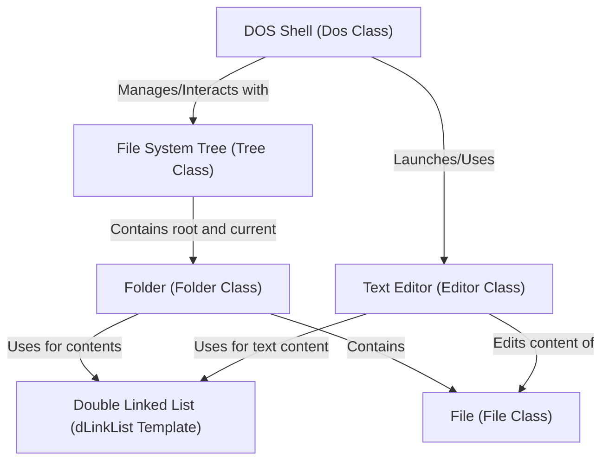

# Tutorial: Dos_Shell_With_NotePade_In_Cpp

This project creates a **virtual DOS-like shell** where users can navigate and manage a simulated **file system**.
It allows commands like `mkdir` (create *folders*), `create` (create *files*), `cd` (change *directories*), and includes a simple **text editor** to *view and modify* the content of *files*.

## Visual Overview

## Chapters

1. [Folder (Folder Class)
](01_folder__folder_class__.md)
2. [File (File Class)
](02_file__file_class__.md)
3. [File System Tree (Tree Class)
](03_file_system_tree__tree_class__.md)
4. [DOS Shell (Dos Class)
](04_dos_shell__dos_class__.md)
5. [Text Editor (Editor Class)
](05_text_editor__editor_class__.md)
6. [Double Linked List (dLinkList Template)
](06_double_linked_list__dlinklist_template__.md)

---
